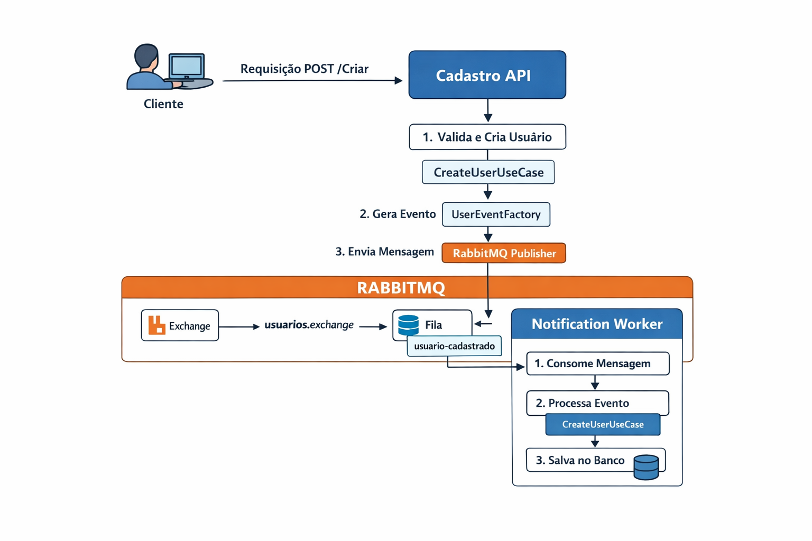
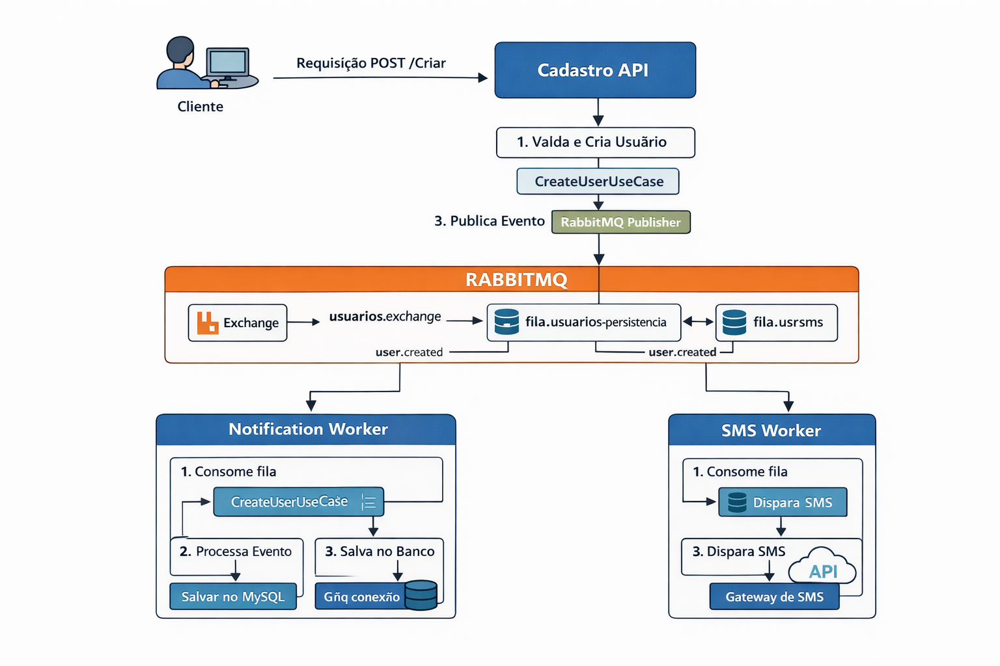

# 📦 Projeto Cadastro & Notificação (Event-Driven)

> Projeto desenvolvido com foco em **fundamentos de Clean Architecture** e **mensageria com RabbitMQ**, no contexto de aprendizado (estágio).

---

## 🎯 Objetivo do Projeto

Demonstrar um fluxo simples de **criação de usuário** onde:

* Uma **API de Cadastro** publica um evento
* Múltiplos **Workers** reagem a esse evento
* Cada Worker possui **responsabilidade única**

Tudo isso sem acoplamento direto entre serviços.

---

## 🧱 Arquitetura Geral

O projeto é dividido em dois grandes contextos:

* **Cadastro** (API produtora de eventos)
* **Notificação** (consumidores / workers)

A comunicação entre eles acontece exclusivamente via **RabbitMQ**.

### Visão geral do fluxo

Fluxo atual:

---
Proxima implementação:

---

## 🧠 Princípios Utilizados

* Clean Architecture (camadas bem definidas)
* Separação de responsabilidades
* Event-driven architecture
* Baixo acoplamento entre serviços
* Infraestrutura isolada da regra de negócio

---

## 🧩 Estrutura de Camadas (Cadastro)

### 📁 `cadastro.Domain`

* Entidades (`User`)
* Value Objects (`Name`, `Email`)
* Regras de negócio puras

➡️ Não depende de nenhuma outra camada.

---

### 📁 `cadastro.Application`

* DTOs de entrada (`CriarUserDTO`)
* DTOs de eventos (`UserCreatedMessage`)
* Use Cases (`CreateUserUseCase`)
* Fábrica de eventos (`UserEventFactory`)

➡️ Orquestra o caso de uso, cria entidades e dispara eventos.

---

### 📁 `cadastro.Infrastructure`

* Implementação do RabbitMQ (`RabbitMqPublisher`)

➡️ Responsável exclusivamente por detalhes técnicos.

---

### 📁 `cadastro.API`

* Controllers
* Ponto de entrada da aplicação Web

➡️ Recebe requisições HTTP e chama o Use Case.

---

## 📨 Mensageria (Ponto-chave do Projeto)

### 🔸 Exchange

* **`usuarios.exchange`**
* Tipo: `direct`
* Responsável apenas por **rotear mensagens**

### 🔸 Evento

* `user.created`
* Representa o fato: *"Um usuário foi criado"*

---

## 📬 Filas e Workers

Cada fila representa um **interesse diferente no mesmo evento**.

### 📌 `fila.usuarios.persistencia`

* Consumida pelo **Notification Worker**
* Responsável por:

    * Mapear DTO → Entidade
    * Persistir no banco de dados (MySQL)

---

### 📌 `fila.usuarios.sms`

* Consumida pelo **SMS Worker**
* Responsável por:

    * Simular envio de SMS
    * Reagir ao evento sem impactar outros fluxos

---

### Fluxo detalhado de eventos

---

## ⚠️ Decisão Importante de Arquitetura

> **Workers diferentes NÃO consomem a mesma fila**.

* Uma fila → uma responsabilidade
* Um evento → múltiplas filas

Isso garante:

* Independência entre consumidores
* Falhas isoladas
* Escalabilidade futura

---

## 🐳 Docker & Infraestrutura

* Cada serviço possui seu próprio Dockerfile
* RabbitMQ e MySQL sobem via `docker-compose`
* Workers possuem ponto de entrada (`Program.cs`)

---

## 📈 Escopo Atual (Intencionalmente Simples)

Este projeto **não implementa**:

* Retry / Polly
* DLQ
* Observabilidade
* Versionamento de eventos

➡️ O foco é **aprender bem o básico antes de avançar**.

---

## 🧑‍💻 Contexto de Desenvolvimento

* Ênfase em aprendizado arquitetural
* Evolução incremental e consciente

---

## ✅ Conclusão

Este projeto demonstra:

* Entendimento correto de mensageria
* Uso consciente de Clean Architecture
* Separação clara de responsabilidades
* Base sólida para evoluções futuras

📌 Próximos passos podem incluir novos consumidores, sem alterar a API.

---

> *"Faça simples, mas faça certo."*
